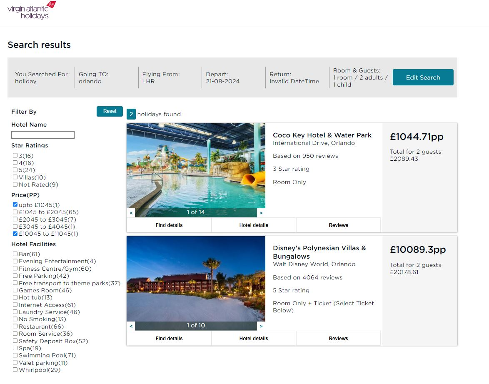
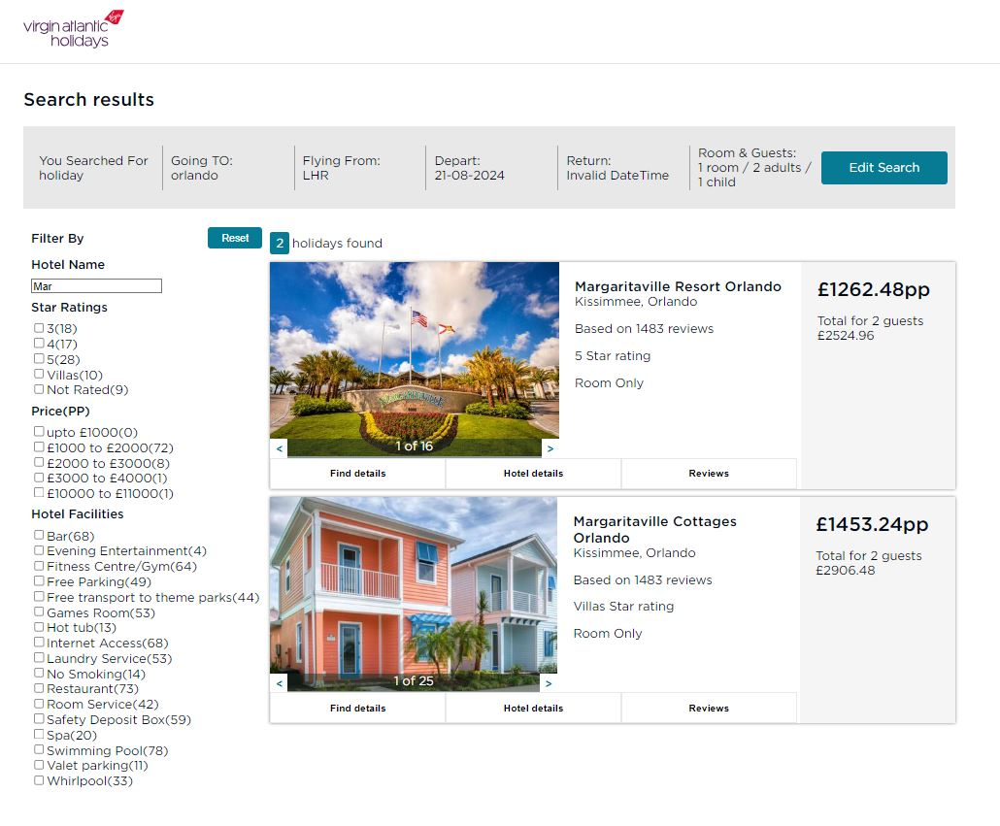

# Virgin Atlantic / Virgin Atlantic Holidays ~ Holiday Search Results (Front-end test)

## Application screens

Thank you for your interest in joining our front-end team and taking the time to do the test. We think it will provide a nice and interesting challenge and a good talking point for the next stage of the process.

## Rules

You must write the application in [React](https://react.dev/) and [TypeScript](https://www.typescriptlang.org/) with [NextJS](https://nextjs.org/). This is all set up and ready to use inside this project.

We have used [new App Router](https://nextjs.org/docs/app/building-your-application/routing) in Next to make the test a bit more interesting and mix rendering on the client and server.

For the test you should adhere to the following conditions:

1. The code must be your own work. If you have a strong case to use a small code snippet of someone else's e.g. a
   boilerplate function, it must be clearly commented and attributed to the original author
1. You must include any unit tests you think are appropriate - Cypress is set up for you already
1. Give consideration to performance and accessibility. Lighthouse scores are high - please keep them that way
1. Code must be clear, concise and human readable
1. We do not want to see how well you can use a UI framework. This is a test and we want to see what you can create so please avoid Bootstrap, Material UI etc
1. Simple CSS has been included but please use whatever CSS flavour you like: LESS, Emotion, Styled Components etc

## Pull Request Explanation

In this pull request, I have implemented the search results page for the front-end test. Here are the key changes made:

1. Created a new component called `SearchResultsComponent` which connects to the holiday search API to fetch and display a list of holidays based on the given location and departure date.

2. Added filters for price per person, hotel facilities, and star rating to allow users to refine their search results.

3. Implemented the API call inside the `SearchResultsComponent` and handled the loading state while waiting for the results to be fetched.

4. Utilized the provided typings in `src/types/booking.ts` to ensure type safety when handling the API response.

5. Included appropriate unit tests using Cypress to ensure the functionality of the search results page.

6. Ensured performance and accessibility considerations by maintaining high Lighthouse scores.

7. Used React, TypeScript, and NextJS as specified in the test requirements.

Please review the code changes in the public GitHub repository: [link-to-repository](https://github.com/your-username/your-repository)

Thank you for your time and consideration. I look forward to your feedback.

## What it should do

Build the 'search results page' which connects to our holiday search API to display a list of holidays for a given location and departure date. Select what data items (example listed below) you think should be included on the page. You can use the [live website](https://www.virginholidays.co.uk) and a holiday search as an example but feel free to change things up.

Add the ability to filter the results by:

1. Price per person
1. Hotel facilities
1. Star rating

The call to the API has been made inside the SearchResultsComponent and some example links are provided on the home route.

Typings for the POST request body and response are provided in `src/types/booking.ts` file.

The endpoint will return data relating to the holiday packages available. The key properties you should be interested in are in the typings. Please note, our endpoint will return much more data, but you are free to ignore this!

Results can be slow to load so you will need to handle this in your code how ever you wish but a basic `loading.tsx` file has been added.

## Supplying your code

Please **create and commit your code into a public Github repository** and supply the link to the recruiter for review.

Thanks for your time, we look forward to hearing from you!

## Running the app

`yarn dev` to start serving the application in development mode. You can check a production ready build by running `yarn build && yarn start`. Please refer to the NextJS documentation for more details.

`yarn cypress:open` to run the Cypress test. We have provided a passing test already for the composition service but would like to see some more.

Built on node `v20.1.0`.
